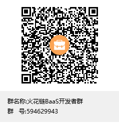
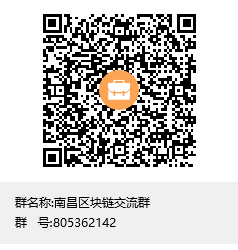

## <a name="2. 接入系统接口">2. 接入系统接口</a>
  
接入系统接口为业务系统上链提供了一系列的接口，首先接入系统得在火花链接入平台进行注册初始化，换取接入应用系统的accessToken。然后就可以根据初始化的相关信息来创建应用系统级别的APP钱包，创建App钱包之后，根据业务所需，为其应用系统中用户在火花链接入平台中创建用户钱包。之后的上链或交易就发生在这些钱包之间。

### <a name="2.1. 接入系统初始化">2.1. 接入系统初始化</a>
   
接入系统初始化对业务系统上链相关的信息进行初始化，主要传入业务系统编号、名称及回调地址,成功时返回appid和appsecret。  
- 接口地址：/v1/app/init

- 请求方式：GET/POST  

- 接口参数：  
 
| 参数         | 类型       | 说明   |
| :------------- |:-------------| :-----|
|appcode|String|业务系统编号,一般用业务系统的拼音缩写或英文|
|appname|String|业务系统名称，一般用中文名|
|transCallBackUrl|String|【可选】业务系统在进行交易时，不能立即返回状态，通过该地址进行回调，获取事务的返回状态|
|msgCallBackUrl|String|【可选】通过该地址进行回调，获取消息的返回值|
|userid|String|【可选】传入租户ID（针对租用平台和企业统一上链接入平台）|

- 请求示例图：  
--- 
  

- 请求示例代码：
--- 
```
/v1/ap/init/appcode=testapp1&appname=testapp1
```

- 结果返回参数：  
 
| 参数         | 类型       | 说明   |
| :------------- |:-------------| :-----|
|code|String|请求结果|
|message|String|返回信息|
|success|boolean|是否成功（true：成功）|
|data|Object|返回数据|
|data.appid|String|业务系统ID|
|data.appsecret|String|业务系统的秘钥|

- 返回示例图：
--- 
  

- 返回示例代码：
--- 
```
{
    "code": "200",
    "data": {
        "appid": "1009273874782617600",
        "appsecret": "55ef31ed-0304-4ecb-b294-e6fc1b098e7c"
    },
    "message": "",
    "success": true
}
```
 
### <a name="2.2. 生成访问凭证">2.2. 生成访问凭证</a></p>  
 
调用其它接口时，一般都需要访问凭证。通过此接口就可以获取访问凭证accessToken，访问凭证有一定的时效性（目前2个小时）。  
<font color=Red >如果需要在代码中使用访问凭证，可以参考附1的简单示例（java语言）</font>

- 接口地址：/v1/app/access  

- 请求方式：GET/POST

- 接口参数：  

| 参数         | 类型       | 说明   |
| :------------- |:-------------| :-----|
|appid|String|业务系统的ID|
|appsecret|String|业务系统的秘钥|  
- 请求示例图： 
--- 


- 请求示例代码：
---
```
/v1/app/access/appid=1009273874782617600&appsecret=55ef31ed-0304-4ecb-b294-e6fc1b098e7c
```
- 结果返回参数： 
 
| 参数         | 类型       | 说明   |
| :------------- |:-------------| :-----|
|code|String|请求结果|
|message|String|返回信息|
|success|boolean|是否成功（true：成功）|
|data|Object|返回数据|
|data.accessToken|String|访问凭证|
- 返回示图：
---

  
- 返回示例代码：
---
```
{
    "code": "200",
    "data": {
        "accessToken": "1e43fe43-bf65-4180-8242-fbf4a30dd29b"
    },
    "message": "",
    "success": true
}
```

### <a name="2.3. 创建企业钱包">2.3. 创建企业钱包</a>

为接入的应用创建一个应用级别的钱包，所有用户钱包的激活及GAS的充值，都需要或者可以通过该钱包来进行转账。企业钱包的充值，可以使用4.2节中的“账户充值”接口，让外部账户进行充值或者转账。
- 接口地址：/v1/app/createAppWallet

- 请求方式：GET/POST

- 接口参数：
 
| 参数         | 类型       | 说明   |
| :------------- |:-------------| :-----|
|accessToken|String|访问凭证|
|chainCodes|String|【可选】区块链编码（多个值，用逗号分隔），目前支持jingtum和moac。如果指定该参数，会在创建App钱包之前为当前的App应用系统关联上对应的公链。也可以使用2.5节中的选择区块链接口预先进行公链的关联。此参数值可为空|
|onlyWallet|boolean|【可选】是否仅生成钱包（默认值为false），如果为true，那么只生成空钱包；如果为false，会在已选的公链上自动创建账户|  

- 请求示例图：
---


- 请求示例代码：
---
```
/v1/app/createAppWallet/accessToken=1e43fe43-bf65-4180-8242-fbf4a30dd29b&chainCodes=moac&onlyWallet=false
```

- 结果返回参数：

| 参数         | 类型       | 说明   |
| :------------- |:-------------| :-----|
|code|String|请求结果|
|message|String|返回信息|
|success|boolean|是否成功（true：成功）|
|data|Object|返回数据|
|data.walletAddr|String|钱包地址,通过该地址可以找到账户|
|data.userId|String|用户Id|
|data.password|String|查询密码|
|data.accounts|list|账户列表|
|data.accounts.chainCode|String |区块链的编码|
|data.accounts.account|String|账户|

- 返回示例图：
---


- 返回示例代码：
---
```
{
    "code": "200",
    "data": {
        "password": "1009273874782617600",
        "walletAddr": "4ed93afd-47bf-43cb-8fd9-ed8ed3c7affe",
        "accounts": [
            {
                "chainCode": "moac",
                "account": "0x08bad40508a3169a3a2e9caa36fa20ef7bd98535"
            }
        ],
        "userId": "1009273874782617600"
    },
    "message": "",
    "success": true
}
```

### <a name="2.4. 创建用户钱包">2.4. 创建用户钱包</a>  
在接入的应用系统中,创建用户钱包，每个人仅可以创建一个用户钱包，以传入的用户名作为应用系统中的唯一标识，密码可以用来设置支付密码。

- 接口地址：/v1/app/createWallet  

- 请求方式：GET/POST

- 接口参数：

| 参数         | 类型       | 说明   |
| :------------- |:-------------| :-----|
|accessToken |String|访问凭证|
|userId|String|用户Id|
|password|String|查询密码|
|onlyWallet|boolean|【可选】是否仅生成钱包（默认值为false），如果为true，那么只生成空钱包；如果为false，会在已选的公链上自动创建账户|  


- 请求示例图：
---


- 请求示例代码：
---
```
/v1/app/createWallet/accessToken=1e43fe43-bf65-4180-8242-fbf4a30dd29b&userId=testapp1_user1&password=123456
```

- 结果返回参数：

| 参数         | 类型       | 说明   |
| :------------- |:-------------| :-----|
|code|String|请求结果|
|message|String|返回信息|
|success|boolean|是否成功（true：成功）|
|data|Object|返回数据|
|data.appId|String|应用Id|
|data.userId|String|用户Id|
|data.accounts|list|账户列表|
|data.accounts.chainCode|String|区块链编码|
|data.accounts.account|String|账户|  

- 返回示例图：
---
  

- 返回示例代码：
---
```
{
    "code": "200",
    "data": {
        "walletAddr": "4402fa2f-0f42-4fde-a736-5727d618b4c9",
        "appId": "1009273874782617600",
        "accounts": [
            {
                "chainCode": "moac",
                "account": "0x9430e338712f4c1026ab181ef01409a06ab73eb7"
            }
        ],
        "userId": "testapp1_user1"
    },
    "message": "",
    "success": true
}
```

### <a name="2.5. 选择区块链">2.5. 选择区块链</a>  
 接入系统在接入区块链时到底接入哪个或哪些公链呢？不像其它平台，在火花链接入平台中，把这个选择的权利完全交给接入系统自己，接入系统不仅能选择块链，同时还可以通过接口来注册相关的公链到火花链平台（未开放），然后进行选择。选择区域链的操作已经集成到创建企业钱包中，没有特殊的要求，不需要单独调用该接口来进行区域链的选择。  
- 接口地址：/v1/app/selectChain  

- 请求方式：GET/POST  

- 接口参数：

| 参数         | 类型       | 说明   |
| :------------- |:-------------| :-----|
|accessToken|String|访问凭证|
|chainCodes|String|区块链编码（多个值时，用逗号分隔），比如：jingtum,moac,eth等|
- 请求示例图：
---


- 请求示例代码：
---
```
/v1/app/selectChain/accessToken=1e43fe43-bf65-4180-8242-fbf4a30dd29b&chainCodes=jingtum
```

- 结果返回参数：  

| 参数         | 类型       | 说明   |
| :------------- |:-------------| :-----|
|code|String|请求结果|
|message|String|返回信息|
|success|boolean|是否成功（true：成功）|
|data|Object|返回数据|  

- 返回示例图： 
---
  

- 返回示例代码：
---
```
{
    "code": "200",
    "data": null,
    "message": "",
    "success": true
}
```

### <a name="2.6. 选择通证">2.6. 选择通证</a>

 接入不同的公链之后，接入系统需要关注的是在其接入系统中需要使用哪一些代币（通证）来进行交易，比如接入系统可以自己发行自己的币种，然后采用自己发行的币种在自己的接入系统中进行交易，这个时候就需要给不同接入系统选择不同的代币（通证）的权利。  
 选择通证的前提是需要发布第三方通证，可以通过第八章的接口进行发布，也可以在交流群中联系管理员进行后台的发布。  
 如果不发行代币的话或者不使用第三方代币的话，那么就没有必要使用该接口来选择通证，对于原生通证（如moac链对应的MOAC代币及jingtum链对应的SWT代币）在创建App钱包时就已经进行了关联，没有必要再进行选择。  
 <font color=red>
 注意：执行该接口之前，请先确保对应的区块链已经选择（执行了“选择区块链”接口，或者在创建钱包时已填写了对应的区块链。
 </font>
- 接口地址：/v1/app/selectToken  

- 请求方式：GET/POST

- 接口参数：  

| 参数         | 类型       | 说明   |
| :------------- |:-------------| :-----|
|accessToken|String|访问凭证|
|chainCode|String|区块链编码(比如：jingtum，moac或eth等)|
|tokenCodes|String|通证编码（多个值时，用逗号分隔）|  
- 请求示例图：
---
  

- 请求示例代码：
---
```
/v1/app/selectToken/accessToken=a7aff191-427a-4275-bf0a-f6f150b486a1&chainCode=moac&tokenCodes=TT1
```

- 结果返回参数：  

| 参数         | 类型       | 说明   |
| :------------- |:-------------| :-----|
|code|String|请求结果|
|message|String|返回信息|
|success|boolean|是否成功（true：成功）|
|data|Object|返回数据|  
- 返回示例图：
---


- 返回示例代码：
---
```
{
    "code": "200",
    "data": null,
    "message": "",
    "success": true
}
```


### <a name="2.7. 同步所有钱包">2.7. 同步所有钱包</a>

接入应用系统已经创建了App钱包和用户钱包并进行交易，有可能需要在应用系统中增加新的公链支持或代币（通证）支持，那么就需要通过选择区块链和和选择通证来进行关联，这时需要为所有用户钱包和app钱包创建新加公链的账户及账户下面的各种不同的代币的余额。  
这就需要采用当前的接口来同步所有钱包，为接入应用系统的所有钱包都加创建新链的账户和初始化新币种的余额。因为调用该接口需要较长时间，平台采用异步处理方式，处理完成之后调用2.1节中msgCallBackUrl参数指定的回调地址回写处理结果，也可能通过调用2.8节中的系统消息来查看其处理结果。  
可见，使用火花链接入平台中接入的话，不需要在接入初始化时考虑过多的需求，可以先接入应用，然后再逐步完善所需要的上链处理。所有的技术细节都屏蔽在火花链接入平台，提供一个简单易用的区块链接入方式。  
- 接口地址：/v1/app/syncAllWallet

- 请求方式：GET/POST  

- 接口参数：  

| 参数         | 类型       | 说明   |
| :------------- |:-------------| :-----|
|accessToken|String|访问凭证|  
- 请求示例图：
---


- 请求示例代码：
---
```
/v1/app/syncAllWallet/accessToken=1e43fe43-bf65-4180-8242-fbf4a30dd29b
```
- 结果返回参数：  

| 参数         | 类型       | 说明   |
| :------------- |:-------------| :-----|
|code|String|请求结果|
|message|String|返回信息|
|data|Object|数据|
|success|boolean|是否成功（true：成功）|
- 返回示例图：  
---


- 返回示例代码：
---
```
{
    "code": "200",
    "data": null,
    "message": "",
    "success": true
}
```

### <a name="2.8. 获取系统消息[待完善]">2.8. 获取系统消息[待完善]</a>  
 接入业务系统在使用火花链接入平台过程，会产生各种不同的系统消息，这些系统消息都保存在接入业务系统对应的消息库中。有的接口会调用注册的消息回调处理（2.1节中的参数）进行回写，有的接口会直接返回。也可以使用当前接口来获取其完整的系统消息列表。  
- 接口地址：/v1/app/sysMsg  

- 请求方式：GET/POST

- 接口参数：  

| 参数         | 类型       | 说明   |
| :------------- |:-------------| :-----|
|accessToken|String|访问凭证|
|msgType|String|【可选】消息类型|
|userId|String|【可选】用户Id|
|msgState|Integer|【可选】消息状态|
|pagesize|Integer|【可选】返回的每页数据量，默认每页10项|
|pagenum|Integer|【可选】返回第几页的数据，默认从1开始|  
- 请求示例图：
---


- 请求示例代码：
---
```
/v1/app/sysMsg/accessToken=1e43fe43-bf65-4180-8242-fbf4a30dd29b&msgType=SYNC_ALL_WALLET_SUCESS
```
- 结果返回参数：

| 参数         | 类型       | 说明   |
| :------------- |:-------------| :-----|
|code|String|请求结果|
|message|String|返回信息|
|success|boolean|是否成功（true：成功）|
|data|Object|数据|
|data.total|Integer|总记录数|
|data.totalPages|Integer|总页数|
|data.meta.appid|Long|应用id|
|data.meta.state|Integer|状态|
|data.meta.type|String|类型|
|data.result|list|结果信息|
|data.result.createtime|Long|创建时间|
|data.result.appid|Long|对应的appid|
|data.result.id|String|消息id|
|data.result.msgs|String|消息内容|
|data.result.state|Integer|状态|
|data.result.type|Integer|消息类型|
|data.result.userId|Integer|用户Id|
|data.result.viewtime|Long|查看时间|
- 返回示例图：
---


- 返回示例代码：
---
```
{
    "code": "200",
    "data": {
        "meta": {
            "appid": 1009273874782617600,
            "state": null,
            "type": "SYNC_ALL_WALLET_SUCESS"
        },
        "needPage": true,
        "number": 1,
        "orderStr": "",
        "orders": [],
        "result": [
            {
                "appid": 1009273874782617600,
                "createtime": 1529471593000,
                "id": "1009303128853446656",
                "msgs": "sync all wallet sucess!",
                "state": 0,
                "type": "SYNC_ALL_WALLET_SUCESS",
                "userid": "",
                "viewtime": null
            },
            {
                "appid": 1009273874782617600,
                "createtime": 1529471748000,
                "id": "1009303781545869312",
                "msgs": "sync all wallet sucess!",
                "state": 0,
                "type": "SYNC_ALL_WALLET_SUCESS",
                "userid": "",
                "viewtime": null
            }
        ],
        "size": 10,
        "startRow": 0,
        "total": 2,
        "totalPages": 1
    },
    "message": "",
    "success": true
}
```


## 官方联系方式

### 官方QQ群



### 官方技术交流论坛
  欢迎大家到<a href="http://sparkda.com/">斯巴达论坛</a>进行提问及交流 

### 官方技术BAAS平台
  欢迎大家到<a href="http://baas.sparkchain.cn/">火花链BaaS平台</a>发现更多好玩的Dapp（目前正开发中）


## 第三方合作伙伴

 - <a href="https://www.jingtum.com/">井通科技</a>,github地址为：https://github.com/swtcpro ，开发者文档地址：http://developer.jingtum.com/  浏览器地址：http://state.jingtum.com

 - <a href="http://www.moac.io/">MOAC</a>,github地址为：ttps://github.com/MOACChain/,开发者文档地址：https://github.com/MOACChain/moac-core/wiki/Commands ,https://github.com/MOACChain/moac-core/wiki/Chain3 ,浏览器地址：http://explorer.moac.io/home

 - 南昌技术开发团队,github地址为:https://github.com/moacDapp/ ,QQ群：

 

